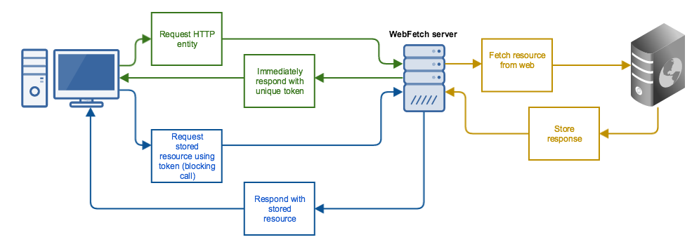

# WebFetch

## Overview

WebFetch is an asynchronous HTTP proxy server that accepts multiple requests
for HTTP retrieval, immediately returning a token for each request, and then
allowing that token to be redeemed later when the entity has fully responded.

This permits issuing multiple HTTP requests in parallel, in a fully
encapsulated and external process, without having to resort to multi-threading,
multi-processing, or complex non-blocking IO implementations.



## Getting Started

Although WebFetch runs as a web server and provides all functionality over a
RESTful API (see below), the simplest way to use it is with its Ruby client
implementation, which wraps the HTTP API for you, using
[Faraday](https://github.com/lostisland/faraday). This also serves as a
[reference](lib/web_fetch/client.rb) for writing WebFetch clients in other languages.

In your `Gemfile`, add:

``` ruby
gem 'web_fetch', git: 'https://github.com/bobf/web_fetch.git'
```

and update your bundle:

``` ruby
bundle install
```

Create, connect to, and wrap a Ruby client object around a new WebFetch server
instance, listening as `localhost` on port `8077`:

``` ruby
require 'web_fetch'
client = WebFetch::Client.create('localhost', 8077)
```

Issue some requests [asynchronously]:

``` ruby
requests = [{ url: 'http://foobar.baz/' },
            { url: 'http://barfoo.baz/foobar',
              headers: { 'User-Agent' => 'Foo Browser' } },
              query: { foo: 'what is foo', bar: 'what is baz' } ]
jobs = client.gather(requests)
```

Retrieve the responses [synchronously - *any result that has not yet arrived
will block until it has arrived while other requests continue to run in
parallel*]:

``` ruby
responses = []
jobs.each do |job|
  response = client.retrieve_by_uid(job[:uid])
  responses.push(response)
end
```

See [a working example](doc/client_example.rb).

## HTTP API

If you need to use the WebFetch server's HTTP API directly refer to the
[Swagger API Reference](swagger.yaml)

## Managing the WebFetch process yourself

You may want to run the WebFetch server yourself rather than instantiate it
via the client. For this case, the executable `bin/web_fetch_server` is
provided.

To connect to an existing process, use `WebFetch::Client.new` rather than
`WebFetch::Client.create`. For example:

``` ruby
WebFetch::Client.new('localhost', 8087)
```

The server will not [usually] output anything to STDOUT or STDERR and currently
no logging is implemented.

## WebFetch Client request options

`WebFetch::Client#gather` accepts an array of hashes which may contain the
following parameters:

  * `url`: The target URL [string]
  * `headers`: HTTP headers [hash]
  * `query`: Query parameters [hash]
  * `method`: HTTP method (default: `"GET"`) [string]
  * `body`: HTTP body [string]

These parameters will all be used (where provided) when initiating the HTTP
request on the target.

Arbitrary parameters can also be passed and will be returned by `#gather`
(though they will not be used to construct the HTTP request). This allows
tagging requests with arbitrary information if you need to identify them in a
particular way. For example, you may want to generate your own unique
identifier for a request, in which case you could do:

``` ruby
client.gather([{ url: 'http://foobar.baz', my_unique_id: '123-456-789' }])
# [{:request=>{:url=>"http://foobar.baz", :my_unique_id=>"123-456-789"}, :hash=>"7c511911d16e1072363fa1653bdd93df65208901", :uid=>"1fb4ee7a-9fc0-4896-9af2-7cbdf234a468"}]
```

## Running on a server.

Check out /linux/init.d/web_fetch.  It should be placed within the bootup scripts on the server.

Additionally make sure this processes pid is monitored and there a process to restart the server.
It doesn't spawn workers or anything.